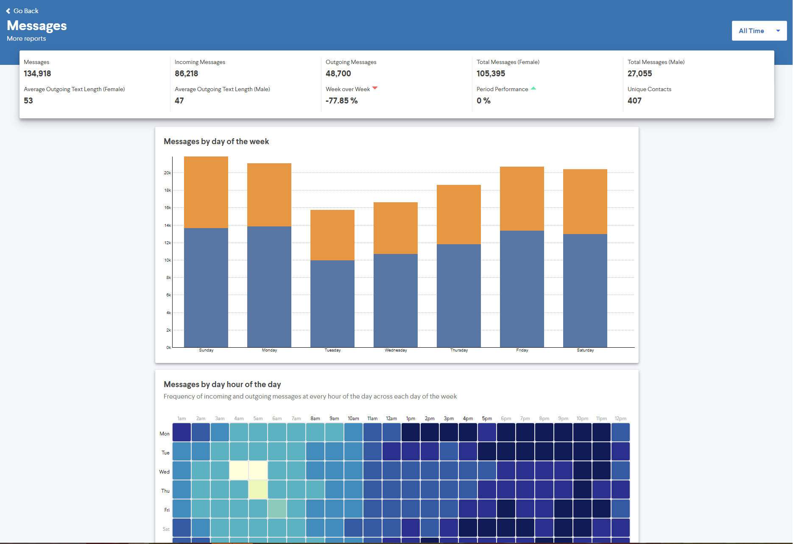

<h1 align="center">A digitial-life viewing application</h1>

<h3 align="center">
  <a href="https://memetrics.net/">Visit MeMetrics</a>
</h3>

<h3 align="center">
  <a href="https://github.com/thirschel/memetrics-ui/blob/master/ARCHITECTURE.md">Architecture Diagram</a> |
  <a href="https://github.com/thirschel/memetrics-infrastructure">Infrastructure</a> |
  <a href="https://github.com/thirschel/memetrics-api">API</a> | 
  <a href="https://github.com/thirschel/memetrics-functions">Functions</a> |
  <a href="https://github.com/thirschel/memetrics-imessage-updater">iMessage Updater</a>
</h3>



## What is MeMetrics?
[I work as a software engineer](https://www.tylerhirschel.com) and this is a pet project I have built in my spare time. I realized that many of the services that I use have some ability to gather the data they store on me. I wanted to take this data and display it in a way that would provide an aggregated view to view trends that may occur. This project encompasses how I would build an application using modern techstack and built for scale. I have also tried to not incldue a technology or service unless it is needed or provides real value to the project. I have made the entire source code public to view and scrutinze.

## What is this?

This project contains the Angular application that acts as the UI for MeMetrics. It is responsible for transforming the data from the API into beautiful and concise graphs and visualizations.

## Setting up development environment 🛠

_If you need to change the endpoint of the api, it can be found in `src/assets/appsettings.json`_
```sh
npm install
npm start
```


## Contributing 🤝

I will not be accepting PR's for this project.